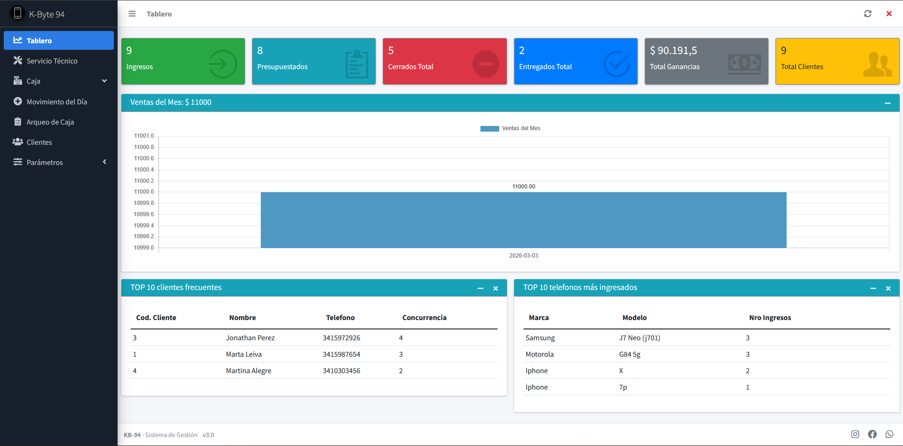

🇬🇧 English version available here: [README.md](README.md)

# Sistema de Gestión para Servicio Técnico

Sistema de gestión web liviano diseñado para optimizar la operativa diaria de un servicio técnico de telefonía móvil.

Este proyecto fue desarrollado originalmente para el local **K-byte 94**, con el objetivo de ofrecer una herramienta rápida, intuitiva y eficiente para registrar órdenes de reparación, gestionar clientes y organizar el trabajo técnico sin sobrecargar los procesos administrativos.

---

# Descripción General

El sistema centraliza el flujo de trabajo de un servicio técnico organizando la información de clientes, órdenes de trabajo y técnicos dentro de una interfaz simple y estructurada.

Se enfoca en:

- Registro rápido de información
- Seguimiento claro del estado de reparaciones
- Generación automática de documentación
- Gestión interna simplificada

La interfaz fue diseñada para funcionar tanto en computadoras como en dispositivos móviles gracias a un diseño responsivo.

---

# Versión Demo

Este repositorio contiene una **versión demo limitada** del sistema.

Algunos módulos fueron deshabilitados intencionalmente para mantener el proyecto simple y enfocado en demostrar el funcionamiento principal.

### Funciones disponibles en el demo

- Gestión de clientes (crear / editar)
- Gestión de técnicos (crear / editar)
- Creación de órdenes de trabajo
- Edición de órdenes de trabajo
- Impresión de órdenes de trabajo

### Módulos deshabilitados en el demo

Los siguientes módulos forman parte del sistema completo pero fueron desactivados en esta versión:

- Tablero / Dashboard
- Gestión de caja
- Movimientos financieros diarios
- Arqueo histórico
- Gestión de marcas
- Gestión de modelos
- Localidades
- Formas de pago
- Registro de pagos
- Historial de pagos

Estas funcionalidades fueron removidas del demo para simplificar el proyecto manteniendo visible la arquitectura principal del sistema.

---

# Funcionalidades Principales

### Base de Datos de Clientes

Administración eficiente de clientes incluyendo:

- Nombre
- Apellido
- Documento
- Localidad
- Dos números de contacto

### Sistema de Órdenes de Trabajo

Cada orden centraliza información técnica relevante como:

- Marca del equipo
- Modelo del equipo
- Falla reportada
- Observaciones técnicas
- Presupuesto
- Técnico responsable

### Seguimiento del Estado de Reparación

Las órdenes siguen un ciclo estructurado:

INGRESO → Cuando el dispositivo es recibido por el taller.

CIERRE → Cuando se completa el proceso de reparación.

ENTREGA → Cuando el dispositivo es devuelto al cliente.

El sistema determina el estado actual en función de la presencia de la fecha correspondiente.

### Documentación Automática

El sistema genera automáticamente una **orden de trabajo por duplicado**:

- Copia para el cliente
- Copia para el laboratorio

---

# Tecnologías Utilizadas

El sistema fue desarrollado como una **aplicación web**.

### Backend
- PHP

### Frontend
- HTML
- CSS
- JavaScript

### Arquitectura
- MVC (Modelo Vista Controlador)

### Persistencia de Datos
- Base de datos MySQL

### Tecnologías adicionales
- AJAX para comunicación asincrónica
- Manipulación del DOM para actualización dinámica de la interfaz
- Diseño responsivo compatible con dispositivos móviles

---

# Arquitectura

La aplicación sigue una estructura **MVC (Modelo-Vista-Controlador)** que permite separar claramente:

- Lógica de negocio
- Acceso a datos
- Interfaz de usuario

Esto mejora la mantenibilidad y escalabilidad del sistema.

---

# Capturas de Pantalla

- 
- 
- 
- 
- 
- 
- 

---

# Instalación

### Requisitos

- PHP
- MySQL
- Servidor web (Apache recomendado)
- Entorno local como XAMPP

### Pasos

1. Clonar el repositorio
git clone https://github.com/AlvaroSanchez01521/KB94-v3Git/

2. Importar la estructura de la base de datos localizada en: database/kb94_demo_database.sql

3. Colocar el proyecto dentro del directorio del servidor web (por ejemplo `/htdocs` si se usa XAMPP).

4. Configurar la conexión a la base de datos.

5. Abrir el sistema desde el navegador.
http://localhost/KB94-v3Git

---

# Propósito del Proyecto

Este proyecto se publica como parte de un **portfolio de desarrollo de software** para demostrar:

- Arquitectura de aplicaciones web
- Desarrollo backend en PHP
- Modelado de bases de datos
- Uso del patrón MVC
- Interacción dinámica mediante AJAX

---

# Autor

Desarrollado por **Alvaro Sanchez**

GitHub Profile:  
https://github.com/AlvaroSanchez01521
